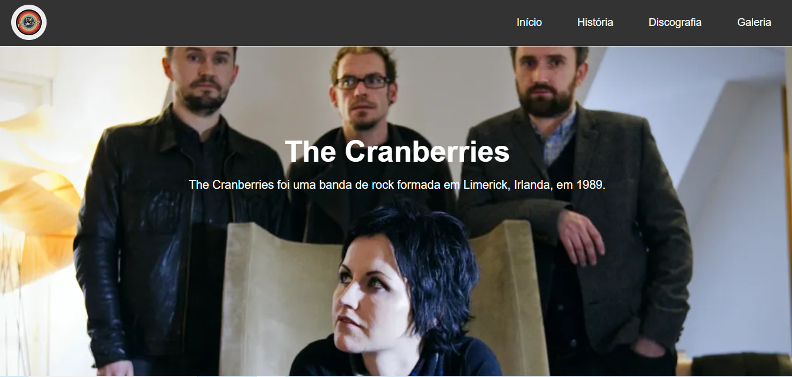
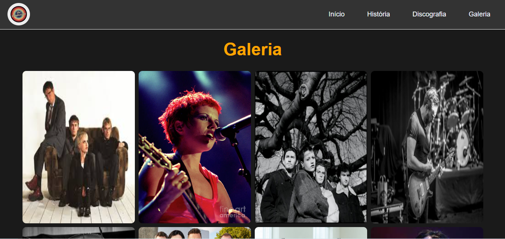

# 🎸 The Cranberries Fan Page 🎸

Bem-vindo ao meu projeto de página de fãs da banda The Cranberries! Este repositório contém o código-fonte para uma página web dedicada a essa incrível banda de rock alternativo da Irlanda. 🌍

## Ferramentas Utilizadas 🛠️

- **HTML5**: Para a estrutura da página.
- **CSS3**: Para estilização e layout responsivo.
- **JavaScript**: Para interatividade e efeitos dinâmicos.
- **Git & GitHub**: Para controle de versão e hospedagem do projeto.

## Habilidades Adquiridas 🚀

- Criação de layouts responsivos com CSS Flexbox e Media Queries.
- Implementação de efeitos de Parallax com CSS.
- Estilização moderna e criativa usando transições e transformações CSS.
- Adição de interatividade com JavaScript.
- Gerenciamento de projetos com Git e GitHub.

## Conhecimentos Desenvolvidos 📚

- Melhoria no uso de seletores CSS e hierarquia de estilos.
- Aprendizado de técnicas avançadas de layout e design web.
- Prática na criação de páginas web interativas e visualmente atraentes.
- Aperfeiçoamento de habilidades em controle de versão com Git.

## Passo a Passo do Projeto 📝

1. **Planejamento**: Decidi criar uma página de fãs para a banda The Cranberries, uma das minhas favoritas! Pensei nas seções necessárias: Início, História, Discografia e Galeria.
2. **Estrutura HTML**: Criei o esqueleto da página usando HTML5, definindo as tags principais e a estrutura das seções.
3. **Estilização CSS**: Usei CSS3 para estilizar a página, garantindo um layout responsivo e moderno. Adicionei efeitos de Parallax e transições para tornar a experiência mais dinâmica.
4. **Interatividade JavaScript**: Adicionei um script JS para melhorar a interatividade, como o efeito de zoom nas imagens da galeria.
5. **Testes e Ajustes**: Testei o site em diferentes dispositivos e navegadores, fazendo ajustes para garantir que tudo funcionasse perfeitamente.
6. **Publicação no GitHub**: Usei Git para controlar as versões do projeto e publiquei o código no GitHub para compartilhar com a comunidade.

## Demonstração 📸

Aqui estão algumas capturas de tela do projeto:

### Página Inicial

### Galeria de Fotos

## Sobre Mim 🧑🏾‍💻

Eu sou Senhorinha Joana Alves, uma mulher negra e LGBT, educadora social e estudante de desenvolvimento fullstack e ciência de dados. Sou super fã da banda The Cranberries e acredito no poder transformador da educação e da tecnologia. 🌟

## Contato 📬

- [LinkedIn](https://www.linkedin.com/in/senhorinha-alves)
- [GitHub](https://github.com/senhorinha-alves)
- [Twitter](https://twitter.com/senhorinha-alves)

---

Espero que você goste deste projeto tanto quanto eu gostei de criá-lo! 🎉

